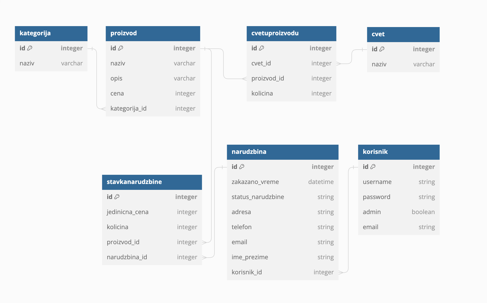
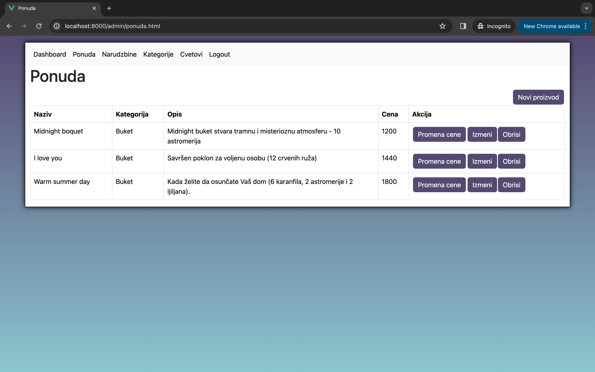
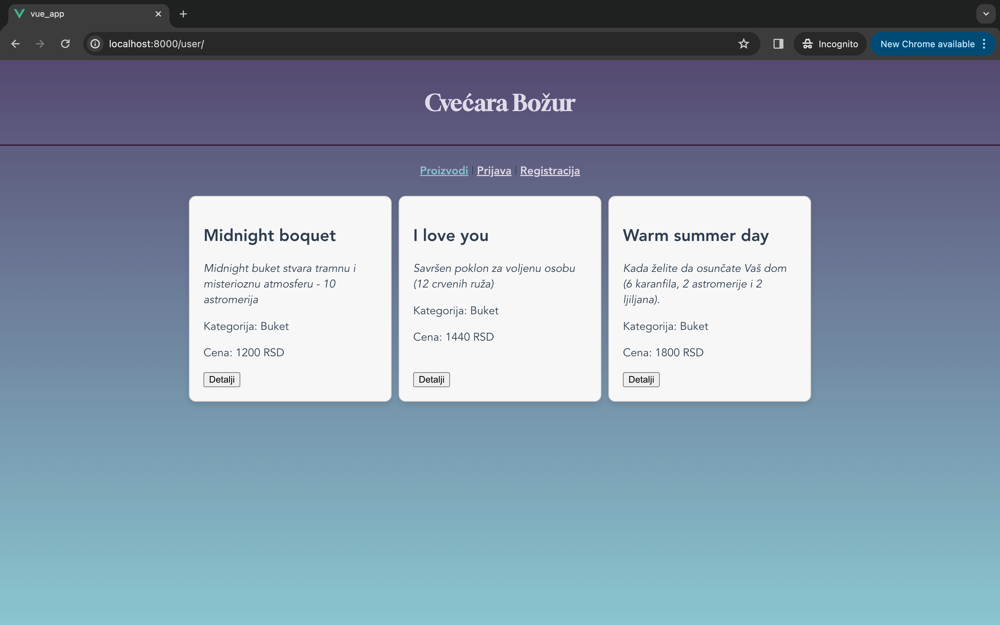
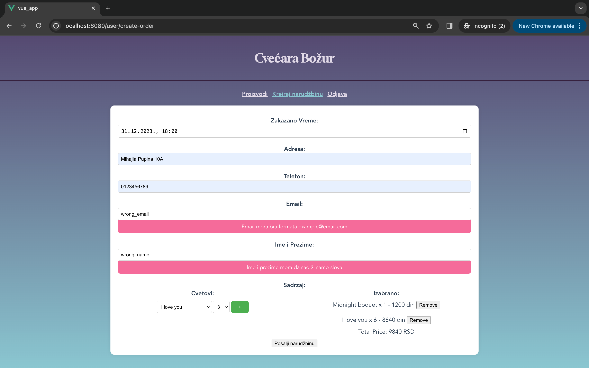

## Web app - flower shop

This project was done as a project for a University subject "Script languages". The task was to create a web app that is something like a web shop. The idea was to create it for Serbian marketplace so the names are in Serbian. This is a flower shop with 2 sides - admin and a user side. Created admin and users can be seen in this [file](api_servis/seeders/0-create-korisnici.js).

### Architecture
1. auth_servis: this service is responsible for the authentication.
2. api_servis: this service acts as a backend that communicates with the database. The documentation for the endpoints can be found in [docs](docs).
3. app_servis: this is the frontend which serves both the user and admin app.

### Running the app
First, start the MySQLDatabase and Apache Web Server on your computer (this can be done through XAMPP).

Secondly, deploy the database as seen in [Deploying the database](#deploying-the-database). From the `api_servis`, `app_servis`, and `auth_servis` folders run:
```
npm install
node app
```

The user app: [http://localhost:8000/user](http://localhost:8000/user)
The admin app: [http://localhost:8000/admin](http://localhost:8000/admin)

### API endpoints
API endpoints are defined in the: <br>
| Directory  | Documentation                                                |
|------------|--------------------------------------------------------------|
| Cvet       | [Cvet API Endpoints](docs/Cvet_API_Endpoints.md)             |
| Kategorija | [Kategorija API Endpoints](docs/Kategorija_API_Endpoints.md) |
| Narudzbina | [Narudzbina API Endpoints](docs/Narudzbina_API_Endpoints.md) |
| Proizvod   | [Proizvod API Endpoints](docs/Proizvod_API_Endpoints.md)     |


### Deploying the database
Database schema can be seen in [database.sql](api_servis/database/database.sql) <br>


From the api_servis run <br>
```
sequelize db:migrate
sequelize db:seed:all
```

If you wish to delete the tables run <br>
```
sequelize db:migrate:undo:all
```

### How the apps look
Admin app -> whole offer: <br>
 <br>

User app -> whole offer: <br>
 <br>

User app -> order creation: <br>
 <br>
