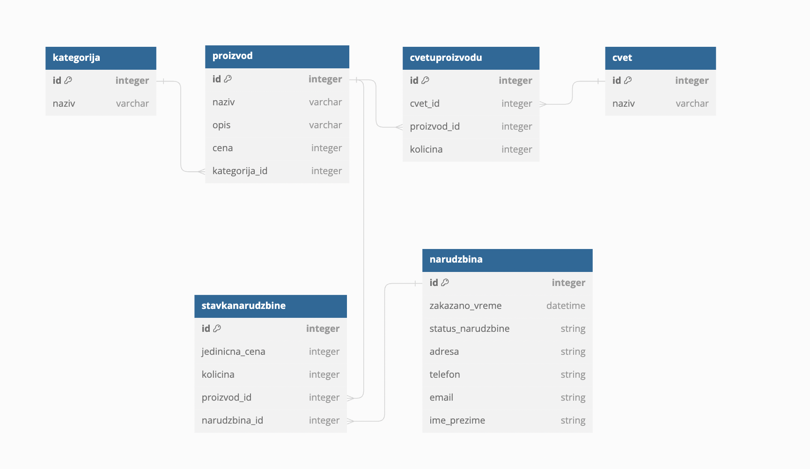

[](https://classroom.github.com/a/GoZPmy3y)

## Cvećara

Irina Tomic RN 72/2022

Grupa 205 (Igor Ciganovic)

### Running the app
First, deploy the database as seen in [Deploying the database](#deploying-the-database). <br>
From the api_servis and app_servis folders run <br>
```
npm install
node app
```

### API endpoints
API endpoints are defines in the: <br>
| Directory  | Documentation                                                |
|------------|--------------------------------------------------------------|
| Cvet       | [Cvet API Endpoints](docs/Cvet_API_Endpoints.md)             |
| Kategorija | [Kategorija API Endpoints](docs/Kategorija_API_Endpoints.md) |
| Narudzbina | [Narudzbina API Endpoints](docs/Narudzbina_API_Endpoints.md) |
| Proizvod   | [Proizvod API Endpoints](docs/Proizvod_API_Endpoints.md)     |


### Deploying the database
Database schema can be seen in [database.sql](api_servis/database/database.sql) <br>


From the api_servis run <br>
```
sequelize db:migrate
sequelize db:seed:all
```

If you wish to delete the tables run <br>
```
sequelize db:migrate:undo:all
```
